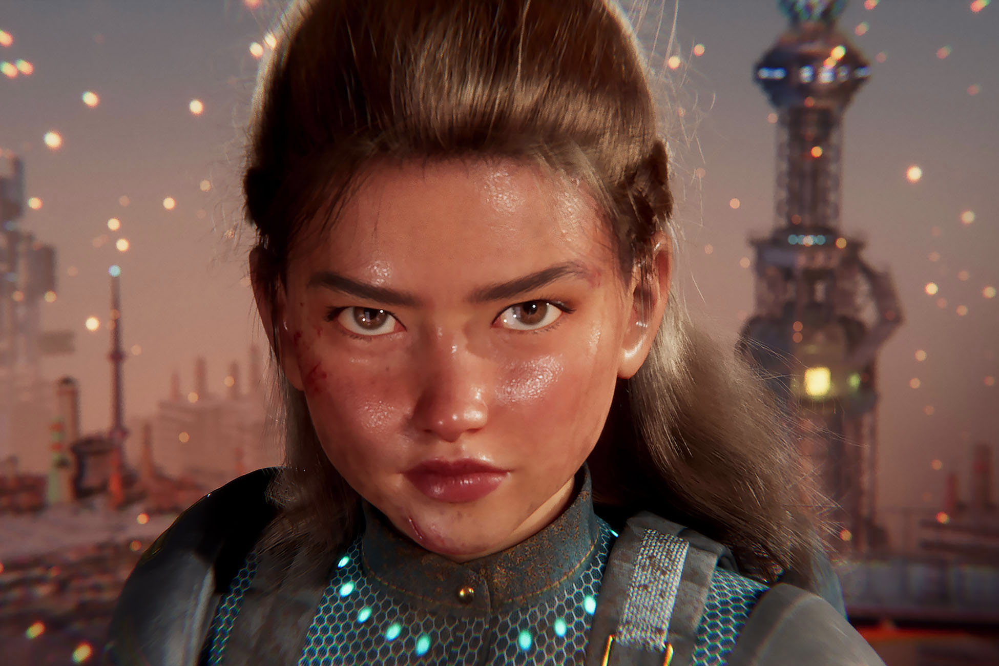
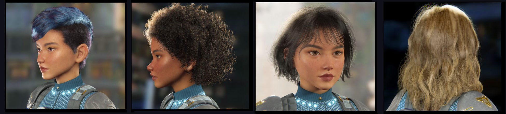

# (URP) Defender Character Demo 
## Character Package, and Hairstyles assets released

**Please note: The digital character in this package is provided under a restricted license for educational and non-commercial use only and attribution to Unity is required. Please read the license terms.**

**The technology stack is under Unity’s standard Asset Store EULA.**

## Animation Demo 
[YouTube](https://www.youtube.com/watch?v=YBtpv7ZdbB4) 
[Bilibili](https://www.bilibili.com/video/BV1g8411p78X/?spm_id_from=333.999.0.0&vd_source=94bf18aef4c51636d11191e668a9854c)

## Description

This package includes a new strand base hair system that integrated from the [AMD’s TressFX](https://gpuopen.com/announcing-unity-china-hairfx/) hair system. This hair system supports both Universal Render Pipeline (URP) and High Definition Render Pipeline (HDRP). Our goal is that this real-time strand hair simulation and rendering system support for cross platform from desktop computer, consoles to mobile devices.

While this hair system has a lot more work remains to be done, we’re sharing what we have at the moment. You’re free to use or modify it to fit your productions and build if needed.

For more information of the hair creation workflow, please check out our Blog

HairFX Core package only is also available on github [here](https://github.com/Unity-China/cn.unity.hairfx.core)

## Requirements

- Unity 2021.2.13f1 +
- Universal Render Pipeline 12.1.4 +

## Here’s what’s in the box
- Defender character with Multi-Hair styles
- Custom ShaderGraph shader for URP:
  + Marschner lighting hair shader
  + Pre-Integrated skin lighting shader
  + Parallax eye shader
  + Anisotropic lighting shader
  + Multi Detail or Thread map shader

## Instruction
1. Option 1: Clone via [Git](https://git-scm.com/) or [GitHub Desktop](https://desktop.github.com/)
   - Install [Git LFS](https://git-lfs.github.com/) if you clone via Git, (not required for GitHub Desktop)
   - After cloning is finished that Inside the repository, run `git lfs install`
 
   Option 2: Direct Download the [Zip file](https://github.com/UnityTechnologies/URP-Defender-Character-Demo/archive/refs/heads/main.zip)
  
2. Launch the project with Unity Editor
3. Open the sample scene: **Assets/(URP) Defender - Character Demo/Scenes/Char_Test.unity**

### Tutorial [(Chinese)](https://learn.u3d.cn/tutorial/Unity-HairFX-Tutorial) [(English)](https://jyb125.tumblr.com/post/703852667664023552/tressfx-hair-plugin-character-package-and)

## Note
- The TressFX Exporter plugin for Maya is in Libray/PackageCache/cn.unity.hairfx.core/**Maya_TressFX_Exporter~** folder or download [here](https://github.com/Unity-China/cn.unity.hairfx.core/tree/main/Maya_TressFX_Exporter~)
- This hair system is not the same hair system that show in ENEMIES demo video, which is separate hair system that created by Unity DemoTeam, you can find it on github [here](https://github.com/Unity-Technologies/com.unity.demoteam.hair)

## Tips
If you build this hair system to mobile platform, please try to limit the total hair strand count less then 10 thousand in the viewing screen to maintain good frame rate. The performance of FPS is also depend on your device hardware.

## Known Issues
Currently not supports Huawei mobile phones due to some device does not support StructuredBuffer for vertex program in shader

Also this hair system tested mainly on iPhone, it may not compatible all Android mobile device

## Related links
[AMD TressFX github](https://github.com/GPUOpen-Effects/TressFX)
